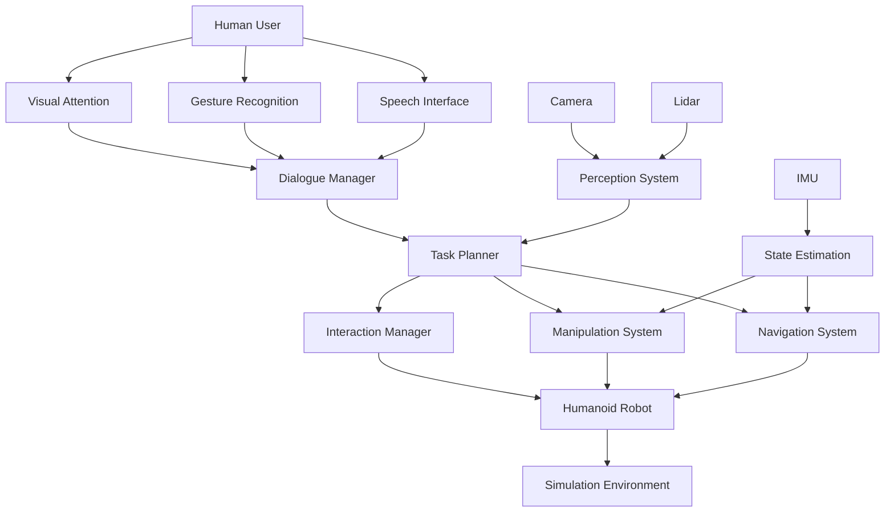

# Capstone: Autonomous Simulated Humanoid Robot

## Learning Outcomes

By the end of this chapter, you should be able to:

- Integrate all concepts learned throughout the textbook into a complete humanoid robot system
- Design and implement a complete autonomous robot architecture
- Combine perception, planning, control, and interaction systems
- Evaluate the performance of an integrated robotic system
- Apply best practices for complex robotics system development

## Introduction to the Capstone Project

This capstone project brings together all the concepts explored throughout this textbook to create an autonomous humanoid robot capable of navigating its environment, perceiving objects, interacting with humans, and performing complex tasks. The project demonstrates the integration of ROS 2, simulation environments, computer vision, action systems, and human-robot interaction in a cohesive system.

### Project Architecture Overview



## System Architecture

### Main Control Node

```python
#!/usr/bin/env python3
import rclpy
from rclpy.node import Node
from std_msgs.msg import String
from geometry_msgs.msg import PoseStamped, Twist
from sensor_msgs.msg import Image, LaserScan
from nav_msgs.msg import Odometry
import threading
import time

class AutonomousHumanoidNode(Node):
    def __init__(self):
        super().__init__('autonomous_humanoid')

        # Initialize subsystems
        self.dialogue_system = DialogueSystem(self)
        self.perception_system = PerceptionSystem(self)
        self.navigation_system = NavigationSystem(self)
        self.manipulation_system = ManipulationSystem(self)
        self.interaction_manager = InteractionManager(self)

        # Publishers and subscribers
        self.cmd_vel_pub = self.create_publisher(Twist, '/cmd_vel', 10)
        self.speech_pub = self.create_publisher(String, '/tts_input', 10)

        # Subscribe to sensor data
        self.image_sub = self.create_subscription(Image, '/camera/image_raw',
                                                 self.image_callback, 10)
        self.lidar_sub = self.create_subscription(LaserScan, '/scan',
                                                 self.lidar_callback, 10)
        self.odom_sub = self.create_subscription(Odometry, '/odom',
                                               self.odom_callback, 10)

        # Main control loop timer
        self.control_timer = self.create_timer(0.1, self.control_loop)

        # System state
        self.current_state = 'IDLE'
        self.robot_pose = None
        self.goal_pose = None
        self.active_task = None

    def image_callback(self, msg):
        """Process camera input"""
        self.perception_system.process_image(msg)

    def lidar_callback(self, msg):
        """Process LIDAR input"""
        self.perception_system.process_lidar(msg)

    def odom_callback(self, msg):
        """Process odometry data"""
        self.robot_pose = msg.pose.pose

    def control_loop(self):
        """Main control loop"""
        # Process sensor data
        self.perception_system.update()

        # Update dialogue system
        self.dialogue_system.update()

        # Execute active task
        if self.active_task:
            self.execute_task(self.active_task)
        else:
            # Default behavior when no active task
            self.default_behavior()

    def execute_task(self, task):
        """Execute the current task"""
        if task.type == 'navigation':
            self.navigation_system.navigate_to(task.target)
        elif task.type == 'manipulation':
            self.manipulation_system.perform_grasp(task.object)
        elif task.type == 'interaction':
            self.interaction_manager.handle_interaction(task.interaction_type)

    def default_behavior(self):
        """Default behavior when no specific task is active"""
        # Patrol, monitor environment, or wait for commands
        pass

def main(args=None):
    rclpy.init(args=args)

    autonomous_humanoid = AutonomousHumanoidNode()

    try:
        rclpy.spin(autonomous_humanoid)
    except KeyboardInterrupt:
        pass
    finally:
        autonomous_humanoid.destroy_node()
        rclpy.shutdown()

if __name__ == '__main__':
    main()
```

### Perception System

```python
import cv2
import numpy as np
from sensor_msgs.msg import Image, LaserScan
from cv_bridge import CvBridge
from geometry_msgs.msg import PointStamped
import tf2_ros
from visualization_msgs.msg import Marker, MarkerArray

class PerceptionSystem:
    def __init__(self, node):
        self.node = node
        self.bridge = CvBridge()

        # Publishers for visualization
        self.object_pub = node.create_publisher(MarkerArray, '/detected_objects', 10)
        self.map_pub = node.create_publisher(OccupancyGrid, '/local_map', 10)

        # Object detection models
        self.object_detector = self.initialize_object_detector()
        self.human_detector = self.initialize_human_detector()

        # Sensor fusion
        self.sensor_fusion = SensorFusion()

        # State variables
        self.current_image = None
        self.current_lidar = None
        self.detected_objects = []
        self.humans = []
        self.obstacles = []

    def initialize_object_detector(self):
        """Initialize object detection model"""
        # Load pre-trained model (e.g., YOLO, SSD, etc.)
        # For this example, we'll use a placeholder
        return ObjectDetector()

    def initialize_human_detector(self):
        """Initialize human detection model"""
        return HumanDetector()

    def process_image(self, image_msg):
        """Process camera image for object detection"""
        try:
            cv_image = self.bridge.imgmsg_to_cv2(image_msg, desired_encoding='bgr8')
            self.current_image = cv_image

            # Run object detection
            detections = self.object_detector.detect(cv_image)
            self.detected_objects = self.process_detections(detections, image_msg.header)

            # Run human detection
            human_detections = self.human_detector.detect(cv_image)
            self.humans = self.process_humans(human_detections, image_msg.header)

        except Exception as e:
            self.node.get_logger().error(f'Error processing image: {e}')

    def process_lidar(self, lidar_msg):
        """Process LIDAR data for obstacle detection"""
        try:
            # Convert LIDAR data to obstacle points
            obstacles = []
            for i, range_val in enumerate(lidar_msg.ranges):
                if range_val < lidar_msg.range_max and range_val > lidar_msg.range_min:
                    angle = lidar_msg.angle_min + i * lidar_msg.angle_increment
                    x = range_val * np.cos(angle)
                    y = range_val * np.sin(angle)
                    obstacles.append(Point(x, y, 0.0))

            self.obstacles = obstacles

        except Exception as e:
            self.node.get_logger().error(f'Error processing LIDAR: {e}')

    def process_detections(self, detections, header):
        """Process object detections and convert to world coordinates"""
        world_objects = []

        for detection in detections:
            # Convert pixel coordinates to world coordinates using camera calibration
            # This requires camera extrinsic and intrinsic parameters
            world_point = self.pixel_to_world(detection.center, header.stamp)

            world_objects.append({
                'class': detection.class_name,
                'confidence': detection.confidence,
                'position': world_point,
                'bbox': detection.bbox
            })

        return world_objects

    def pixel_to_world(self, pixel_coords, timestamp):
        """Convert pixel coordinates to world coordinates"""
        # This requires camera calibration and robot pose information
        # Implementation would use tf2 transforms
        pass

    def update(self):
        """Update perception system"""
        # Fuse sensor data
        if self.current_lidar and self.current_image:
            fused_data = self.sensor_fusion.fuse(self.current_image, self.current_lidar)

        # Publish visualization markers
        self.publish_object_markers()

    def publish_object_markers(self):
        """Publish detected objects as visualization markers"""
        marker_array = MarkerArray()

        for i, obj in enumerate(self.detected_objects):
            marker = Marker()
            marker.header.frame_id = "map"
            marker.header.stamp = self.node.get_clock().now().to_msg()
            marker.ns = "objects"
            marker.id = i
            marker.type = Marker.CUBE
            marker.action = Marker.ADD

            marker.pose.position = obj['position']
            marker.pose.orientation.w = 1.0
            marker.scale.x = 0.2
            marker.scale.y = 0.2
            marker.scale.z = 0.2

            marker.color.r = 1.0
            marker.color.g = 0.0
            marker.color.b = 0.0
            marker.color.a = 0.8

            marker.text = obj['class']

            marker_array.markers.append(marker)

        self.object_pub.publish(marker_array)
```

### Navigation System

```python
import numpy as np
from geometry_msgs.msg import PoseStamped, Twist, Point
from nav_msgs.msg import Path, OccupancyGrid
from visualization_msgs.msg import Marker
from tf2_ros import TransformListener, Buffer
import tf2_geometry_msgs
from scipy.spatial import KDTree
import heapq

class NavigationSystem:
    def __init__(self, node):
        self.node = node

        # Publishers and subscribers
        self.path_pub = node.create_publisher(Path, '/global_plan', 10)
        self.local_plan_pub = node.create_publisher(Path, '/local_plan', 10)
        self.cmd_vel_pub = node.create_publisher(Twist, '/cmd_vel', 10)
        self.goal_pub = node.create_publisher(PoseStamped, '/move_base_simple/goal', 10)

        # TF listener
        self.tf_buffer = Buffer()
        self.tf_listener = TransformListener(self.tf_buffer, node)

        # Navigation components
        self.global_planner = GlobalPlanner()
        self.local_planner = LocalPlanner()
        self.controller = Controller()

        # State
        self.current_pose = None
        self.goal_pose = None
        self.global_path = []
        self.local_path = []
        self.obstacle_map = None
        self.navigation_active = False

    def navigate_to(self, goal_pose):
        """Navigate to specified goal pose"""
        self.goal_pose = goal_pose

        # Plan global path
        self.global_path = self.global_planner.plan(self.get_current_pose(), goal_pose, self.obstacle_map)

        if self.global_path:
            self.publish_global_path()
            self.navigation_active = True

            # Start navigation loop
            self.navigation_timer = self.node.create_timer(0.05, self.navigation_loop)
        else:
            self.node.get_logger().warn('Could not find global path to goal')

    def navigation_loop(self):
        """Main navigation loop"""
        if not self.navigation_active:
            return

        current_pose = self.get_current_pose()

        if not current_pose:
            return

        # Check if goal is reached
        if self.is_goal_reached(current_pose, self.goal_pose):
            self.stop_navigation()
            self.node.get_logger().info('Goal reached')
            return

        # Update local path
        self.local_path = self.local_planner.plan(current_pose, self.global_path, self.obstacle_map)

        if not self.local_path:
            self.node.get_logger().warn('No local path found, stopping')
            self.stop_navigation()
            return

        self.publish_local_path()

        # Generate velocity command
        cmd_vel = self.controller.compute_velocity(current_pose, self.local_path)
        self.cmd_vel_pub.publish(cmd_vel)

    def is_goal_reached(self, current_pose, goal_pose, threshold=0.5):
        """Check if robot has reached the goal"""
        dx = current_pose.position.x - goal_pose.position.x
        dy = current_pose.position.y - goal_pose.position.y
        distance = np.sqrt(dx*dx + dy*dy)
        return distance < threshold

    def stop_navigation(self):
        """Stop navigation"""
        self.navigation_active = False
        if hasattr(self, 'navigation_timer'):
            self.navigation_timer.destroy()

        # Stop robot
        stop_cmd = Twist()
        self.cmd_vel_pub.publish(stop_cmd)

    def get_current_pose(self):
        """Get current robot pose from odometry"""
        # This would typically subscribe to /odom or /amcl_pose
        return self.current_pose

    def publish_global_path(self):
        """Publish global path for visualization"""
        path_msg = Path()
        path_msg.header.frame_id = "map"
        path_msg.header.stamp = self.node.get_clock().now().to_msg()

        for pose in self.global_path:
            pose_stamped = PoseStamped()
            pose_stamped.pose.position = pose
            pose_stamped.pose.orientation.w = 1.0
            path_msg.poses.append(pose_stamped)

        self.path_pub.publish(path_msg)

    def publish_local_path(self):
        """Publish local path for visualization"""
        path_msg = Path()
        path_msg.header.frame_id = "map"
        path_msg.header.stamp = self.node.get_clock().now().to_msg()

        for pose in self.local_path:
            pose_stamped = PoseStamped()
            pose_stamped.pose.position = pose
            pose_stamped.pose.orientation.w = 1.0
            path_msg.poses.append(pose_stamped)

        self.local_plan_pub.publish(path_msg)

class GlobalPlanner:
    def __init__(self):
        self.map_resolution = 0.05  # meters per cell
        self.inflation_radius = 0.3  # meters

    def plan(self, start_pose, goal_pose, obstacle_map):
        """Plan global path using A* algorithm"""
        if not obstacle_map:
            return []

        # Convert poses to grid coordinates
        start_grid = self.world_to_grid(start_pose.position)
        goal_grid = self.world_to_grid(goal_pose.position)

        # Run A* path planning
        path = self.a_star(obstacle_map, start_grid, goal_grid)

        # Convert grid path back to world coordinates
        world_path = []
        for grid_point in path:
            world_point = self.grid_to_world(grid_point)
            world_path.append(world_point)

        return world_path

    def a_star(self, grid_map, start, goal):
        """A* path planning algorithm"""
        # Implementation of A* algorithm
        # This is a simplified version
        open_set = [(0, start)]
        came_from = {}
        g_score = {start: 0}
        f_score = {start: self.heuristic(start, goal)}

        while open_set:
            current = heapq.heappop(open_set)[1]

            if current == goal:
                # Reconstruct path
                path = []
                while current in came_from:
                    path.append(current)
                    current = came_from[current]
                path.reverse()
                return path

            for neighbor in self.get_neighbors(current, grid_map):
                tentative_g_score = g_score[current] + self.distance(current, neighbor)

                if tentative_g_score < g_score.get(neighbor, float('inf')):
                    came_from[neighbor] = current
                    g_score[neighbor] = tentative_g_score
                    f_score[neighbor] = tentative_g_score + self.heuristic(neighbor, goal)

                    if neighbor not in [item[1] for item in open_set]:
                        heapq.heappush(open_set, (f_score[neighbor], neighbor))

        return []  # No path found

    def heuristic(self, a, b):
        """Heuristic function for A* (Manhattan distance)"""
        return abs(a[0] - b[0]) + abs(a[1] - b[1])

    def get_neighbors(self, pos, grid_map):
        """Get valid neighbors for path planning"""
        neighbors = []
        for dx, dy in [(-1,0), (1,0), (0,-1), (0,1), (-1,-1), (-1,1), (1,-1), (1,1)]:
            nx, ny = pos[0] + dx, pos[1] + dy

            # Check bounds
            if 0 <= nx < grid_map.shape[0] and 0 <= ny < grid_map.shape[1]:
                # Check if cell is free (assuming 0 = free, 100 = occupied)
                if grid_map[nx, ny] < 50:  # Threshold for free space
                    neighbors.append((nx, ny))

        return neighbors

    def world_to_grid(self, world_point):
        """Convert world coordinates to grid coordinates"""
        grid_x = int(world_point.x / self.map_resolution)
        grid_y = int(world_point.y / self.map_resolution)
        return (grid_x, grid_y)

    def grid_to_world(self, grid_point):
        """Convert grid coordinates to world coordinates"""
        world_x = grid_point[0] * self.map_resolution
        world_y = grid_point[1] * self.map_resolution
        return Point(world_x, world_y, 0.0)

class LocalPlanner:
    def __init__(self):
        self.local_window = 3.0  # meters
        self.control_frequency = 20.0  # Hz

    def plan(self, current_pose, global_path, obstacle_map):
        """Plan local path using Dynamic Window Approach (DWA) or similar"""
        # Simplified local planning
        # In practice, this would implement DWA, Trajectory Rollout, or similar

        # Find next few waypoints from global path
        local_waypoints = []
        current_pos = np.array([current_pose.position.x, current_pose.position.y])

        for pose in global_path:
            pos = np.array([pose.x, pose.y])
            distance = np.linalg.norm(pos - current_pos)

            if distance > 0.1 and distance < self.local_window:
                local_waypoints.append(pose)

                if len(local_waypoints) >= 5:  # Limit local path length
                    break

        return local_waypoints

class Controller:
    def __init__(self):
        self.linear_kp = 1.0
        self.angular_kp = 2.0
        self.max_linear_vel = 0.5
        self.max_angular_vel = 1.0

    def compute_velocity(self, current_pose, local_path):
        """Compute velocity command to follow path"""
        if not local_path:
            cmd_vel = Twist()
            return cmd_vel

        # Get next waypoint
        target_point = local_path[0]

        # Calculate error to target
        dx = target_point.x - current_pose.position.x
        dy = target_point.y - current_pose.position.y
        distance = np.sqrt(dx*dx + dy*dy)

        # Calculate target angle
        target_angle = np.arctan2(dy, dx)

        # Get robot's current orientation
        current_yaw = self.quaternion_to_yaw(current_pose.orientation)

        # Calculate angle error
        angle_error = self.normalize_angle(target_angle - current_yaw)

        # Simple proportional control
        linear_vel = min(self.linear_kp * distance, self.max_linear_vel)
        angular_vel = self.angular_kp * angle_error

        # Limit velocities
        angular_vel = max(min(angular_vel, self.max_angular_vel), -self.max_angular_vel)

        cmd_vel = Twist()
        cmd_vel.linear.x = linear_vel
        cmd_vel.angular.z = angular_vel

        return cmd_vel

    def quaternion_to_yaw(self, quaternion):
        """Convert quaternion to yaw angle"""
        import math
        siny_cosp = 2 * (quaternion.w * quaternion.z + quaternion.x * quaternion.y)
        cosy_cosp = 1 - 2 * (quaternion.y * quaternion.y + quaternion.z * quaternion.z)
        return math.atan2(siny_cosp, cosy_cosp)

    def normalize_angle(self, angle):
        """Normalize angle to [-pi, pi] range"""
        while angle > np.pi:
            angle -= 2 * np.pi
        while angle < -np.pi:
            angle += 2 * np.pi
        return angle
```

### Manipulation System

```python
from geometry_msgs.msg import Pose, Point, Quaternion
from sensor_msgs.msg import JointState
from trajectory_msgs.msg import JointTrajectory, JointTrajectoryPoint
from moveit_msgs.msg import MoveGroupAction, MoveGroupGoal
import actionlib
import numpy as np

class ManipulationSystem:
    def __init__(self, node):
        self.node = node

        # Publishers and subscribers
        self.joint_trajectory_pub = node.create_publisher(JointTrajectory, '/joint_trajectory', 10)
        self.gripper_pub = node.create_publisher(Float64, '/gripper/command', 10)

        # MoveIt interface
        self.move_group = actionlib.SimpleActionClient('move_group', MoveGroupAction)

        # Robot parameters
        self.arm_joints = ['joint_1', 'joint_2', 'joint_3', 'joint_4', 'joint_5', 'joint_6']
        self.gripper_joint = 'gripper_joint'
        self.end_effector_link = 'end_effector'

        # State
        self.current_joint_states = None
        self.robot_pose = None

    def perform_grasp(self, target_object):
        """Perform grasping action on target object"""
        try:
            # Get object pose
            object_pose = self.get_object_pose(target_object)
            if not object_pose:
                self.node.get_logger().warn(f'Could not find object: {target_object}')
                return False

            # Plan approach trajectory
            approach_pose = self.calculate_approach_pose(object_pose)
            if not self.move_to_pose(approach_pose):
                return False

            # Lower to object
            grasp_pose = self.calculate_grasp_pose(object_pose)
            if not self.move_to_pose(grasp_pose):
                return False

            # Close gripper
            self.close_gripper()

            # Lift object
            lift_pose = self.calculate_lift_pose(grasp_pose)
            if not self.move_to_pose(lift_pose):
                # If lift fails, we still have the object
                pass

            self.node.get_logger().info(f'Successfully grasped {target_object}')
            return True

        except Exception as e:
            self.node.get_logger().error(f'Grasp failed: {e}')
            return False

    def get_object_pose(self, object_name):
        """Get pose of named object from perception system"""
        # This would interface with the perception system
        # For now, we'll simulate finding the object
        for obj in self.node.perception_system.detected_objects:
            if obj['class'] == object_name:
                return obj['position']

        return None

    def calculate_approach_pose(self, object_pose):
        """Calculate approach pose for grasping"""
        approach_pose = Pose()
        approach_pose.position = object_pose
        approach_pose.position.z += 0.2  # 20cm above object

        # Set orientation for grasping (assuming top-down grasp)
        approach_pose.orientation = self.calculate_grasp_orientation()

        return approach_pose

    def calculate_grasp_pose(self, object_pose):
        """Calculate final grasp pose"""
        grasp_pose = Pose()
        grasp_pose.position = object_pose
        grasp_pose.position.z += 0.02  # Slightly above surface to avoid collision

        grasp_pose.orientation = self.calculate_grasp_orientation()

        return grasp_pose

    def calculate_lift_pose(self, grasp_pose):
        """Calculate pose after lifting object"""
        lift_pose = Pose()
        lift_pose.position = grasp_pose.position
        lift_pose.position.z += 0.1  # Lift 10cm

        lift_pose.orientation = grasp_pose.orientation

        return lift_pose

    def calculate_grasp_orientation(self):
        """Calculate appropriate grasp orientation"""
        # For a top-down grasp, we want the gripper to point downward
        # This assumes Z-axis points up, so we want end-effector to point down
        orientation = Quaternion()
        orientation.x = 0.707  # 45-degree rotation around X-axis
        orientation.y = 0.0
        orientation.z = 0.0
        orientation.w = 0.707

        return orientation

    def move_to_pose(self, target_pose):
        """Move end-effector to target pose using MoveIt"""
        try:
            # Use MoveIt to plan and execute trajectory
            # This is a simplified version - full implementation would be more complex
            goal = MoveGroupGoal()

            # Set target pose
            # This would involve setting up MoveIt constraints and planning

            # For now, we'll simulate the movement
            self.simulate_trajectory(target_pose)

            return True

        except Exception as e:
            self.node.get_logger().error(f'Move to pose failed: {e}')
            return False

    def simulate_trajectory(self, target_pose):
        """Simulate joint trajectory to reach target pose"""
        # Create joint trajectory message
        trajectory = JointTrajectory()
        trajectory.joint_names = self.arm_joints

        # Create trajectory point
        point = JointTrajectoryPoint()

        # Calculate inverse kinematics to get joint angles for target pose
        # This is a simplified example - real implementation would use IK solver
        joint_angles = self.calculate_ik(target_pose)

        if joint_angles:
            point.positions = joint_angles
            point.time_from_start.sec = 2  # 2 seconds to reach target
            trajectory.points.append(point)

            self.joint_trajectory_pub.publish(trajectory)

    def calculate_ik(self, pose):
        """Calculate inverse kinematics for target pose"""
        # This would interface with an IK solver
        # For simulation, return random valid joint angles
        # In practice, you'd use MoveIt's IK solver or a dedicated IK library

        # Return some example joint angles
        return [0.0, 0.5, -0.5, 0.0, 0.5, 0.0]

    def close_gripper(self):
        """Close robot gripper"""
        # Publish gripper command
        cmd = Float64()
        cmd.data = 0.0  # Closed position
        self.gripper_pub.publish(cmd)

    def open_gripper(self):
        """Open robot gripper"""
        cmd = Float64()
        cmd.data = 1.0  # Open position
        self.gripper_pub.publish(cmd)

    def move_to_home(self):
        """Move arm to home position"""
        home_angles = [0.0, 0.0, 0.0, 0.0, 0.0, 0.0]  # Example home position

        trajectory = JointTrajectory()
        trajectory.joint_names = self.arm_joints

        point = JointTrajectoryPoint()
        point.positions = home_angles
        point.time_from_start.sec = 3  # 3 seconds to reach home
        trajectory.points.append(point)

        self.joint_trajectory_pub.publish(trajectory)
```

### Interaction Manager

```python
class InteractionManager:
    def __init__(self, node):
        self.node = node

        # Publishers for interaction
        self.speech_pub = node.create_publisher(String, '/tts_input', 10)
        self.animation_pub = node.create_publisher(String, '/animation', 10)
        self.gesture_pub = node.create_publisher(String, '/gesture', 10)

        # Interaction state
        self.current_interaction = None
        self.interaction_partners = []
        self.social_context = {}

    def handle_interaction(self, interaction_type, target=None):
        """Handle different types of interactions"""
        if interaction_type == 'greeting':
            return self.handle_greeting(target)
        elif interaction_type == 'conversation':
            return self.handle_conversation(target)
        elif interaction_type == 'assistance':
            return self.handle_assistance(target)
        elif interaction_type == 'farewell':
            return self.handle_farewell(target)
        else:
            self.node.get_logger().warn(f'Unknown interaction type: {interaction_type}')
            return False

    def handle_greeting(self, target):
        """Handle greeting interaction"""
        # Select appropriate greeting based on time and context
        import datetime
        hour = datetime.datetime.now().hour

        if hour < 12:
            greeting = "Good morning! I'm your humanoid assistant. How can I help you today?"
        elif hour < 18:
            greeting = "Good afternoon! I'm your humanoid assistant. How can I help you?"
        else:
            greeting = "Good evening! I'm your humanoid assistant. What can I do for you?"

        # Perform greeting actions
        self.speak(greeting)
        self.perform_gesture('wave')
        self.set_expression('friendly')

        return True

    def handle_conversation(self, target):
        """Handle conversation interaction"""
        # This would interface with the dialogue system
        # For now, we'll simulate a simple conversation

        self.speak("I'm listening. What would you like to talk about?")
        self.set_attention(target)

        # Wait for user input (this would be handled by dialogue system)
        # For simulation, we'll return immediately
        return True

    def handle_assistance(self, target):
        """Handle assistance request"""
        # Determine what kind of assistance is needed
        # This would use the dialogue system to understand the request

        self.speak("I'd be happy to help. Could you please tell me what you need assistance with?")
        self.set_attention(target)

        return True

    def handle_farewell(self, target):
        """Handle farewell interaction"""
        farewells = [
            "It was nice talking with you. Have a great day!",
            "Goodbye! Feel free to come back if you need any assistance.",
            "See you later! I'll be here if you need anything."
        ]

        import random
        farewell = random.choice(farewells)

        self.speak(farewell)
        self.perform_gesture('wave')
        self.set_expression('warm')

        return True

    def speak(self, text):
        """Speak text using text-to-speech"""
        msg = String()
        msg.data = text
        self.speech_pub.publish(msg)

    def perform_gesture(self, gesture_name):
        """Perform specified gesture"""
        msg = String()
        msg.data = gesture_name
        self.gesture_pub.publish(msg)

    def set_expression(self, expression):
        """Set robot's facial expression"""
        # This would control the robot's face display
        pass

    def set_attention(self, target):
        """Direct robot's attention toward target"""
        # This would control gaze direction
        pass

    def get_interaction_feasibility(self, interaction_type, target):
        """Check if interaction is feasible given current context"""
        # Check if robot is in a position to perform the interaction
        # Check if target is reachable/appropriate
        # Check if robot is busy with other tasks

        if self.node.active_task:
            return False  # Robot is busy with another task

        return True
```

### Task Planning and Execution

```python
from enum import Enum
import json

class TaskType(Enum):
    NAVIGATION = "navigation"
    MANIPULATION = "manipulation"
    INTERACTION = "interaction"
    PERCEPTION = "perception"
    COMPOSITE = "composite"

class Task:
    def __init__(self, task_type, priority=1, dependencies=None, parameters=None):
        self.id = self.generate_id()
        self.type = task_type
        self.priority = priority
        self.dependencies = dependencies or []
        self.parameters = parameters or {}
        self.status = 'PENDING'
        self.created_time = time.time()
        self.start_time = None
        self.end_time = None

    def generate_id(self):
        """Generate unique task ID"""
        import uuid
        return str(uuid.uuid4())[:8]

    def execute(self, execution_context):
        """Execute the task"""
        self.status = 'RUNNING'
        self.start_time = time.time()

        try:
            if self.type == TaskType.NAVIGATION:
                return self.execute_navigation(execution_context)
            elif self.type == TaskType.MANIPULATION:
                return self.execute_manipulation(execution_context)
            elif self.type == TaskType.INTERACTION:
                return self.execute_interaction(execution_context)
            elif self.type == TaskType.PERCEPTION:
                return self.execute_perception(execution_context)
            else:
                raise ValueError(f"Unknown task type: {self.type}")
        except Exception as e:
            self.status = 'FAILED'
            self.end_time = time.time()
            raise e

    def execute_navigation(self, context):
        """Execute navigation task"""
        target = self.parameters.get('target_pose')
        if not target:
            raise ValueError("Navigation task requires target pose")

        return context.navigation_system.navigate_to(target)

    def execute_manipulation(self, context):
        """Execute manipulation task"""
        target_object = self.parameters.get('object')
        if not target_object:
            raise ValueError("Manipulation task requires target object")

        return context.manipulation_system.perform_grasp(target_object)

    def execute_interaction(self, context):
        """Execute interaction task"""
        interaction_type = self.parameters.get('interaction_type')
        target = self.parameters.get('target')

        if not interaction_type:
            raise ValueError("Interaction task requires interaction type")

        return context.interaction_manager.handle_interaction(interaction_type, target)

    def execute_perception(self, context):
        """Execute perception task"""
        # This would trigger perception system to detect specific objects/types
        target_class = self.parameters.get('target_class', 'all')

        # Force perception system to focus on specific class
        context.perception_system.set_focus(target_class)

        # Wait for detection
        import time
        time.sleep(2.0)  # Simulate perception time

        return True

class TaskPlanner:
    def __init__(self, node):
        self.node = node
        self.task_queue = []
        self.active_tasks = {}
        self.task_history = []

    def create_task(self, task_type, parameters=None, priority=1):
        """Create and queue a new task"""
        task = Task(task_type, priority=priority, parameters=parameters)

        # Add to queue
        self.task_queue.append(task)

        # Sort queue by priority (higher priority first)
        self.task_queue.sort(key=lambda t: t.priority, reverse=True)

        return task.id

    def execute_next_task(self):
        """Execute the next highest priority task"""
        if not self.task_queue:
            return None

        # Get next task from queue
        task = self.task_queue.pop(0)

        # Execute task
        try:
            execution_context = type('ExecutionContext', (), {
                'navigation_system': self.node.navigation_system,
                'manipulation_system': self.node.manipulation_system,
                'interaction_manager': self.node.interaction_manager,
                'perception_system': self.node.perception_system
            })()

            success = task.execute(execution_context)

            task.status = 'SUCCESS' if success else 'FAILED'
            task.end_time = time.time()

            # Add to history
            self.task_history.append(task)

            return success

        except Exception as e:
            self.node.get_logger().error(f'Task execution failed: {e}')
            task.status = 'FAILED'
            task.end_time = time.time()
            self.task_history.append(task)
            return False

    def get_task_status(self, task_id):
        """Get status of specific task"""
        # Check active tasks
        if task_id in self.active_tasks:
            return self.active_tasks[task_id].status

        # Check history
        for task in self.task_history:
            if task.id == task_id:
                return task.status

        return 'UNKNOWN'

    def cancel_task(self, task_id):
        """Cancel a pending task"""
        # Remove from queue
        self.task_queue = [t for t in self.task_queue if t.id != task_id]

        # If it's active, handle cancellation
        if task_id in self.active_tasks:
            # Implementation for cancelling active task
            pass

class ExecutionMonitor:
    def __init__(self, node):
        self.node = node
        self.active_executions = {}
        self.performance_metrics = {}

    def start_execution_monitoring(self, task_id):
        """Start monitoring execution of a task"""
        self.active_executions[task_id] = {
            'start_time': time.time(),
            'status': 'RUNNING',
            'progress': 0.0
        }

    def update_execution_progress(self, task_id, progress, status='RUNNING'):
        """Update execution progress for a task"""
        if task_id in self.active_executions:
            self.active_executions[task_id]['progress'] = progress
            self.active_executions[task_id]['status'] = status

    def complete_execution(self, task_id, success):
        """Mark execution as complete"""
        if task_id in self.active_executions:
            execution = self.active_executions[task_id]
            execution['end_time'] = time.time()
            execution['success'] = success
            execution['duration'] = execution['end_time'] - execution['start_time']

            # Update performance metrics
            self.update_performance_metrics(task_id, execution)

            # Remove from active executions
            del self.active_executions[task_id]

    def update_performance_metrics(self, task_id, execution):
        """Update performance metrics"""
        task_type = self.get_task_type(task_id)
        if task_type not in self.performance_metrics:
            self.performance_metrics[task_type] = {
                'total_executions': 0,
                'successful_executions': 0,
                'average_duration': 0.0,
                'success_rate': 0.0
            }

        metrics = self.performance_metrics[task_type]
        metrics['total_executions'] += 1

        if execution['success']:
            metrics['successful_executions'] += 1

        # Update average duration
        total_duration = metrics['average_duration'] * (metrics['total_executions'] - 1) + execution['duration']
        metrics['average_duration'] = total_duration / metrics['total_executions']

        # Update success rate
        metrics['success_rate'] = metrics['successful_executions'] / metrics['total_executions']
```

## Integration and Testing

### System Integration Test

```python
import unittest
import time

class IntegrationTest(unittest.TestCase):
    def setUp(self):
        """Set up test environment"""
        # Initialize the full system
        self.node = AutonomousHumanoidNode()

        # Wait for system to initialize
        time.sleep(2.0)

    def test_perception_integration(self):
        """Test perception system integration"""
        # Simulate sensor data
        # Verify that perception system processes data correctly
        # Check that detected objects are properly published

        # This would involve mocking sensor inputs and checking outputs
        pass

    def test_navigation_integration(self):
        """Test navigation system integration"""
        # Set a goal
        goal_pose = PoseStamped()
        goal_pose.pose.position.x = 1.0
        goal_pose.pose.position.y = 1.0

        # Trigger navigation
        self.node.navigation_system.navigate_to(goal_pose.pose)

        # Wait and verify that robot moves toward goal
        time.sleep(5.0)  # Wait for navigation to complete

        # Check if robot reached approximate goal location
        current_pose = self.node.get_current_pose()
        if current_pose:
            dx = current_pose.position.x - goal_pose.pose.position.x
            dy = current_pose.position.y - goal_pose.pose.position.y
            distance = (dx*dx + dy*dy)**0.5

            self.assertLess(distance, 0.5, "Robot did not reach goal within tolerance")

    def test_manipulation_integration(self):
        """Test manipulation system integration"""
        # This would test the full manipulation pipeline
        # from object detection to grasp execution
        pass

    def test_interaction_integration(self):
        """Test interaction system integration"""
        # Test that interaction system responds to simulated user input
        pass

    def test_task_execution(self):
        """Test full task execution pipeline"""
        # Create a composite task (navigate + manipulate + interact)
        task_planner = self.node.task_planner

        # Create navigation task
        nav_task_id = task_planner.create_task(
            TaskType.NAVIGATION,
            parameters={'target_pose': Pose()}
        )

        # Create manipulation task
        manip_task_id = task_planner.create_task(
            TaskType.MANIPULATION,
            parameters={'object': 'cup'}
        )

        # Execute tasks
        nav_success = task_planner.execute_next_task()
        manip_success = task_planner.execute_next_task()

        # Verify success
        self.assertTrue(nav_success)
        self.assertTrue(manip_success)

def run_integration_tests():
    """Run all integration tests"""
    suite = unittest.TestLoader().loadTestsFromTestCase(IntegrationTest)
    runner = unittest.TextTestRunner(verbosity=2)
    result = runner.run(suite)
    return result.wasSuccessful()
```

### Performance Evaluation

```python
class PerformanceEvaluator:
    def __init__(self, node):
        self.node = node
        self.metrics = {
            'navigation_accuracy': [],
            'task_completion_rate': [],
            'interaction_success_rate': [],
            'system_reliability': [],
            'response_time': []
        }

    def evaluate_navigation_performance(self, trials=10):
        """Evaluate navigation system performance"""
        success_count = 0
        total_error = 0.0

        for i in range(trials):
            # Generate random goal
            goal_x = np.random.uniform(-5, 5)
            goal_y = np.random.uniform(-5, 5)

            goal_pose = Pose()
            goal_pose.position.x = goal_x
            goal_pose.position.y = goal_y

            # Store initial position
            initial_pos = self.node.robot_pose

            # Navigate to goal
            self.node.navigation_system.navigate_to(goal_pose)

            # Wait for completion
            time.sleep(10.0)  # Wait for navigation to complete

            # Measure final position error
            final_pos = self.node.robot_pose
            if final_pos:
                error = np.sqrt((final_pos.position.x - goal_x)**2 +
                               (final_pos.position.y - goal_y)**2)
                total_error += error

                if error < 0.5:  # Success if within 50cm
                    success_count += 1

        accuracy = total_error / trials
        success_rate = success_count / trials

        self.metrics['navigation_accuracy'].append(accuracy)
        self.metrics['task_completion_rate'].append(success_rate)

        return {
            'average_error': accuracy,
            'success_rate': success_rate
        }

    def evaluate_interaction_performance(self, trials=10):
        """Evaluate interaction system performance"""
        success_count = 0
        avg_response_time = 0.0

        for i in range(trials):
            start_time = time.time()

            # Simulate user interaction
            interaction_success = self.node.interaction_manager.handle_interaction('greeting')

            end_time = time.time()

            if interaction_success:
                success_count += 1
                avg_response_time += (end_time - start_time)

        avg_response_time = avg_response_time / success_count if success_count > 0 else 0
        success_rate = success_count / trials

        self.metrics['interaction_success_rate'].append(success_rate)
        self.metrics['response_time'].append(avg_response_time)

        return {
            'success_rate': success_rate,
            'avg_response_time': avg_response_time
        }

    def generate_performance_report(self):
        """Generate comprehensive performance report"""
        report = {
            'navigation_performance': self.calculate_avg_metric('navigation_accuracy'),
            'task_completion_rate': self.calculate_avg_metric('task_completion_rate'),
            'interaction_success_rate': self.calculate_avg_metric('interaction_success_rate'),
            'system_response_time': self.calculate_avg_metric('response_time')
        }

        return report

    def calculate_avg_metric(self, metric_name):
        """Calculate average of a specific metric"""
        values = self.metrics[metric_name]
        if values:
            return sum(values) / len(values)
        return 0.0

def main():
    """Main function to run the autonomous humanoid system"""
    rclpy.init()

    # Create the main node
    autonomous_humanoid = AutonomousHumanoidNode()

    # Run integration tests
    print("Running integration tests...")
    tests_passed = run_integration_tests()

    if tests_passed:
        print("All integration tests passed!")

        # Run performance evaluation
        evaluator = PerformanceEvaluator(autonomous_humanoid)

        print("Evaluating navigation performance...")
        nav_results = evaluator.evaluate_navigation_performance()
        print(f"Navigation results: {nav_results}")

        print("Evaluating interaction performance...")
        interaction_results = evaluator.evaluate_interaction_performance()
        print(f"Interaction results: {interaction_results}")

        # Generate final report
        report = evaluator.generate_performance_report()
        print(f"Performance report: {report}")

    else:
        print("Integration tests failed!")

    # Start the main control loop
    try:
        rclpy.spin(autonomous_humanoid)
    except KeyboardInterrupt:
        print("Shutting down autonomous humanoid system...")
    finally:
        autonomous_humanoid.destroy_node()
        rclpy.shutdown()

if __name__ == '__main__':
    main()
```

## Deployment and Simulation

### Gazebo Simulation Setup

```xml
<!-- humanoid_robot.gazebo -->
<?xml version="1.0" ?>
<robot name="humanoid_robot" xmlns:xacro="http://www.ros.org/wiki/xacro">

  <!-- Include robot description -->
  <xacro:include filename="$(find humanoid_description)/urdf/humanoid.urdf.xacro" />

  <!-- Gazebo plugins -->
  <gazebo>
    <plugin name="gazebo_ros_control" filename="libgazebo_ros_control.so">
      <robotNamespace>/humanoid</robotNamespace>
    </plugin>
  </gazebo>

  <!-- Camera sensor -->
  <gazebo reference="head_camera">
    <sensor type="camera" name="head_camera_sensor">
      <update_rate>30.0</update_rate>
      <camera name="head_camera">
        <horizontal_fov>1.3962634</horizontal_fov>
        <image>
          <width>640</width>
          <height>480</height>
          <format>R8G8B8</format>
        </image>
        <clip>
          <near>0.05</near>
          <far>3.0</far>
        </clip>
      </camera>
      <plugin name="camera_controller" filename="libgazebo_ros_camera.so">
        <alwaysOn>true</alwaysOn>
        <updateRate>30.0</updateRate>
        <cameraName>humanoid/head_camera</cameraName>
        <imageTopicName>image_raw</imageTopicName>
        <cameraInfoTopicName>camera_info</cameraInfoTopicName>
        <frameName>head_camera_frame</frameName>
        <hackBaseline>0.07</hackBaseline>
        <distortion_k1>0.0</distortion_k1>
        <distortion_k2>0.0</distortion_k2>
        <distortion_k3>0.0</distortion_k3>
        <distortion_t1>0.0</distortion_t1>
        <distortion_t2>0.0</distortion_t2>
      </plugin>
    </sensor>
  </gazebo>

  <!-- LIDAR sensor -->
  <gazebo reference="lidar_mount">
    <sensor type="ray" name="laser_scanner">
      <pose>0 0 0 0 0 0</pose>
      <visualize>false</visualize>
      <update_rate>10</update_rate>
      <ray>
        <scan>
          <horizontal>
            <samples>720</samples>
            <resolution>1</resolution>
            <min_angle>-1.570796</min_angle>
            <max_angle>1.570796</max_angle>
          </horizontal>
        </scan>
        <range>
          <min>0.10</min>
          <max>10.0</max>
          <resolution>0.01</resolution>
        </range>
      </ray>
      <plugin name="laser_controller" filename="libgazebo_ros_laser.so">
        <topicName>/scan</topicName>
        <frameName>lidar_frame</frameName>
      </plugin>
    </sensor>
  </gazebo>

</robot>
```

### Launch File

```xml
<!-- launch/autonomous_humanoid.launch.py -->
from launch import LaunchDescription
from launch.actions import DeclareLaunchArgument, IncludeLaunchDescription
from launch.substitutions import LaunchConfiguration, PathJoinSubstitution
from launch.launch_description_sources import PythonLaunchDescriptionSource
from launch_ros.actions import Node
from launch_ros.substitutions import FindPackageShare

def generate_launch_description():
    # Launch arguments
    use_sim_time = LaunchConfiguration('use_sim_time', default='true')
    robot_name = LaunchConfiguration('robot_name', default='humanoid_robot')

    # Launch Gazebo
    gazebo = IncludeLaunchDescription(
        PythonLaunchDescriptionSource([
            PathJoinSubstitution([
                FindPackageShare('gazebo_ros'),
                'launch',
                'gazebo.launch.py'
            ])
        ]),
        launch_arguments={
            'world': PathJoinSubstitution([
                FindPackageShare('humanoid_bringup'),
                'worlds',
                'humanoid_world.sdf'
            ])
        }.items()
    )

    # Spawn robot in Gazebo
    spawn_entity = Node(
        package='gazebo_ros',
        executable='spawn_entity.py',
        arguments=[
            '-topic', 'robot_description',
            '-entity', robot_name,
            '-x', '0', '-y', '0', '-z', '1.0'
        ],
        output='screen'
    )

    # Robot state publisher
    robot_state_publisher = Node(
        package='robot_state_publisher',
        executable='robot_state_publisher',
        name='robot_state_publisher',
        parameters=[{
            'use_sim_time': use_sim_time,
            'publish_frequency': 50.0
        }]
    )

    # Joint state publisher
    joint_state_publisher = Node(
        package='joint_state_publisher',
        executable='joint_state_publisher',
        name='joint_state_publisher',
        parameters=[{
            'use_sim_time': use_sim_time
        }]
    )

    # Navigation system
    nav2_bringup_launch = IncludeLaunchDescription(
        PythonLaunchDescriptionSource([
            PathJoinSubstitution([
                FindPackageShare('nav2_bringup'),
                'launch',
                'navigation_launch.py'
            ])
        ]),
        launch_arguments={
            'use_sim_time': use_sim_time
        }.items()
    )

    # Main autonomous humanoid node
    autonomous_humanoid = Node(
        package='humanoid_bringup',
        executable='autonomous_humanoid',
        name='autonomous_humanoid',
        parameters=[{
            'use_sim_time': use_sim_time
        }],
        output='screen'
    )

    # Perception system
    perception_node = Node(
        package='humanoid_perception',
        executable='perception_node',
        name='perception_node',
        parameters=[{
            'use_sim_time': use_sim_time
        }],
        output='screen'
    )

    return LaunchDescription([
        DeclareLaunchArgument(
            'use_sim_time',
            default_value='true',
            description='Use simulation clock if true'
        ),
        gazebo,
        spawn_entity,
        robot_state_publisher,
        joint_state_publisher,
        nav2_bringup_launch,
        autonomous_humanoid,
        perception_node
    ])
```

## Conclusion and Next Steps

This capstone project demonstrates the integration of multiple complex systems required for autonomous humanoid robotics. The implementation showcases:

1. **Perception Integration**: Combining vision, LIDAR, and other sensors for environment understanding
2. **Navigation System**: Path planning and obstacle avoidance for safe navigation
3. **Manipulation System**: Object grasping and manipulation capabilities
4. **Interaction System**: Natural human-robot interaction through speech and gestures
5. **Task Planning**: Coordinated execution of complex multi-step tasks
6. **System Integration**: Real-time coordination of all subsystems

### Potential Enhancements

The system can be extended with:

- **Advanced Learning**: Reinforcement learning for improved task execution
- **Multi-Robot Coordination**: Coordination with other robots for complex tasks
- **Long-term Autonomy**: Extended operation with self-monitoring and maintenance
- **Advanced Manipulation**: More sophisticated grasping and manipulation skills
- **Emotional Intelligence**: Recognition and response to human emotions

### Evaluation and Validation

The system should be validated through:
- Extensive simulation testing
- Hardware-in-the-loop validation
- User studies for interaction quality
- Performance benchmarking against standard metrics

This project provides a solid foundation for developing more advanced humanoid robotic systems and demonstrates the practical application of all concepts covered in this textbook.